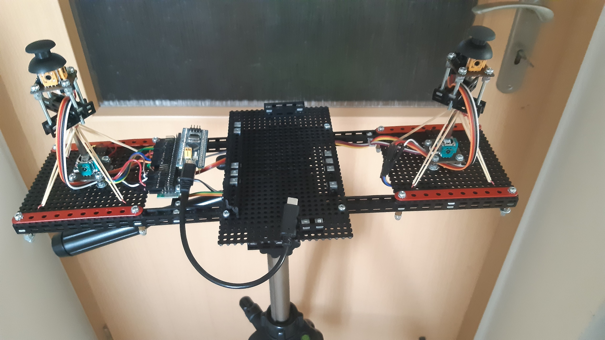
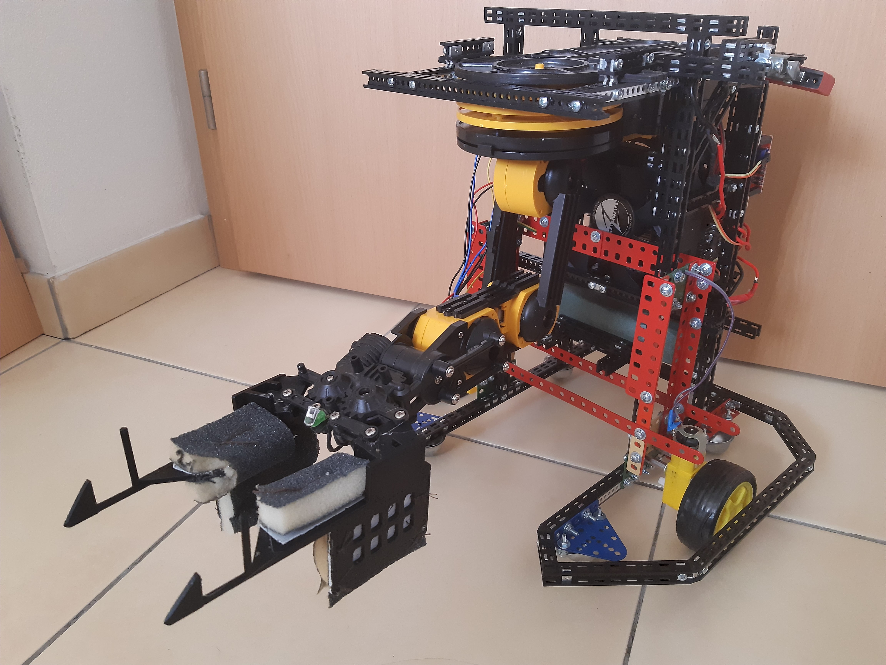
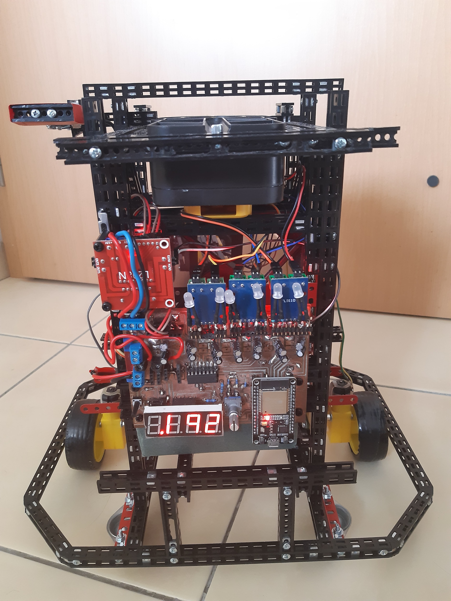

# Článek CZU na Roborickém dnu

## Účast týmu ČZU na soutěži Robotický den.
Tým se skládal ze studentů Technické fakulty z Pavla Ňachaje, autora robota, a Tomáše Hradila jako spoluautora konstrukce robota.
Robot se jmenoval „BuckysPlasticArm“ https://github.com/PNmJunior/RB2022-TymRECYLKON-TCB-BuckysPlasticArm.git . Tento robot je ovládán přes webové rozhraní, to znamená pomoci webového prohlížeče.
Jedná se o dost specifické téma, k porozumění je potřeba vám předat informace a popis věcí v IoT, kde byste to mohli použít.

## Jaké jsou typické způsoby ovládání?
V dnešní době má většina IoT věcí pro ovládaní vlastní aplikace nebo je lze ovládat přes jeden centralizovaný server.
U vlastní aplikace je většinou komunikace po lokální síti nebo Bluetooth. Potom je zde údržba aplikace, její aktualizace….
U centrálního webserveru je sice super, že máme k dispozici data odkudkoliv na světě, ale funkčnost systému je závislá na funkčnosti centrálního webserveru a to jak se připojí výrobek k internetu. Situaci komplikuje nutnost kódování dat, které je pro mikrokontrolery jako ESP32 relativně náročné a pomalé.

## Proč bych měl chtít ovládat něco přes webový prohlížeč v lokální síti?
Protokoly pro web jsou známé dostupné a udržuje se jejich podpora. To umožní po připojení stáhnout si web stránku z lokálního webserveru, který je umístěn ve výrobku. A následně komunikovat po lokální síti. Výrobek umí to, co do něj bylo nahráno. Takovýto koncept nevyžaduje údržbu ze strany autora výrobku. 

## Proč se tomu tak neděje?
Jsou zde dvě velké překážky pro to, aby to fungovalo. Prvním problémem je výběr wifi a zadání hesla. Druhým problémem je jak informovat uživatele, co má zadat do vyhledávače, za předpokladu, že jsou připojení v jedné síti.
Uložením hesla do jakéhokoliv zařízení je bezpečnostní riziko a to se dělí na dva typy: Zařízení u kterých se ví, že existují/existovaly způsoby jak hesla získat a u zařízení, u kterých se o to zatím marně pokoušejí hackeři nebo se ještě o tom veřejně neví.
Protože je bezpečnost u celé rodiny čipů dost diskutabilní, je zde otázka, zda by mělo být ESP32 umožněno se připojit na server mimo lokální síť? Protože lokální síť chrání služby routeru, který oddělují sítě mezi sebou a tím pro okolní svět zůstane tajemstvím existence výrobku s ESP32. Bohužel je možné obejít bezpečnostní služby routeru pomoci napadnutého zařízení v lokální sítí. Díky napadnutému zařízení může ovládat klidně i zmíněné ESP32, jen je to přes prostředníka….
Další problém je to, jak výrobek má sdělit přidělené ip adresy od DHCP serveru umístěném v routeru.
Tyto problémy vyžadují klávesnici a displej, co by každou například chytrou žárovku by výrazně prodražilo.

## Proč aplikace nemají tento problém?
Většina aplikací využívají Bluetooth ke komunikaci. Autor může Bluetooth modul uvnitř výrobku typicky pojmenovat a zaheslovat. To znamená, že aplikace si s sebou nese filtr na rozpoznání svých zařízení a heslo k nim. Ale velkým problémem jsou náročné aktualizace aplikace způsobené Bluetooth modulem na straně uživatele. Interface se mění vůči operačnímu systému, výrobce zařízení na straně uživatele, a dokonce i modelu telefonu s Androidem. Taková  situace vyžaduje pravidelné testování, které je finančně a časově náročné. Proto se může se stát, že po několika letech si koupíte nový telefon a aplikace nebude fungovat, protože například aplikace u nového Androidu nepožádá o nový druh oprávnění, který předtím neexistoval a tu věc aplikace používala. Ze strany autora je vyžadovaná pravidelná údržba aplikace kvůli softwaru, operačnímu systému, tak hardwaru. Kolik platíte za tyto aplikace? Na základě toho, jak dlouho si myslíte, že budou fungovat?

## Zakončení úvodu
Tenhle úvod bych zakončil tím, že si myslím, že právě webové servery mají budoucnost, ale je potřeba vyřešit problémy.
Proto jsem si vymyslel téma, které není jednoduché a bude dost široké na to abych se setkal se základními problémy a musel bych je se pokusit je vyřešit.
Na tomto projektu jsem pracoval více než rok. Začal jsem měsíc před soutěží Robotický den 2022 http://robotickyden.cz/2022/. Projekt jsem ukončil po soutěži Robotický den 2023 https://robotickyden.cz/2023/, nasbírané zkušenosti bych chtěl aplikovat v jiných projektech. Řešil jsem problém řízení 8 motorů pomoci ESP32. Díky architektuře webserveru se může na řízení podílet hned několik zařízení najednou. Jako základ jsem použil projekt „ESP32 Web Server (WebSocket) with Multiple Sliders: Control LEDs Brightness (PWM)“ https://randomnerdtutorials.com/esp32-web-server-websocket-sliders/ který jsem značně upravil a přizpůsobil pro mé účely. Zjednodušil a výrazně urychlil komunikační protokol až na real time i při připojených několika klientů zároveň. Abych toho docílil, rozhodl jsem se, že ESP32 připojím jako k wifi, nikoliv, že budu generovat wifi z ESP32, chtěl jsem tím zjednodušit situaci a ušetřit výkon ESP32. Hned na začátku jsem zjistil, že je zde problém o kterém jsem se zatím ještě nezmínil a to je různá implementace html a stylů v různých prohlížecích. Jako základní prvek jsem měl „Range Sliders“ a následné jsem kvůli lepšímu ovládaní potřeboval slidery vodorovný a vertikální. Každý prohlížeč to pojal posvém. Na soutěži 2022 jsem měl za sebou měsíc práce a lepší řešení se mi nepodařilo vymyslet než slidery. Soutěžil jsem ve disciplíně „Toy Cleanup Beginner“ kde se ale moc nepředvedl kvůli neustálým změnám ve konstrukci a dalším problémům způsobené tím, že to byl projekt na poslední chvílí.
Po přestávce ve vývoji jsem udělal nový hardware, kde jsem přidal displej a enkodér pro volbu wifi a zadaní hesla. Software jsem značně přeprogramoval. Následné jsem vyrobil odlišný komunikační protokol odlišný od JSON, který se to té doby používal a o kterém jsem se zmínil. Přidal jsme řízení pomoci joysticku, takže jedním dotekem teď šlo ovládat dva motory, místo předchozího jednoho motoru pomoci slideru. Následně jsem experimentoval s rozdílnými duálními cestami řízení až jsem skončil u přepsaní Java aplikace pro Android pro telnet, kde jsem připsal funkce pro připojení k ESP serveru a převáděl jsem data z USB do serveru. Následně jsem k telefonu připojil pomoci USB čip STM32 ke kterému jsem připojil manuální joysticky. Na závěr jsem si zkusil detekci přerušení spojení. Následně si jednotlivé věci projdeme podrobněji.

## Vlastní komunikační protokol
Jednalo se o protokol textový založený na dvou dvou klíčových znacích, „;“ označoval začátek příkazu a „:“ rozděluje jednotlivé složky. Zde jsem později doplatil na to, že jsem neměl koncový znak. Viz dále v sekci aplikaci. Na straně ESP32 se programuje v C++ a na straně webového prohlížeče se to zpracovává v JavaScriptu. Je velmi důležité si vyrobit stejnou struktura a názvosloví pro funkce zpracovávající data. Další možností je využití WebAssembly https://webassembly.org/ kde C++ kód funguje přímo na prohlížecí a díky dalším krokům JavaScript umí tyto C++ funkce zavolat, naplnit vstup a přečíst výsledek funkce.

## Sjednocení fukcionalyty
Zatímco html je u každého prohlížeče je odlišné tak JavaScript všude funguje stejně. Stačí si vyrobit obrázkové podklady a následně je použít pomoci JavaScriptu. Bude to fungovat všude stejně.

## Dualita řízeni
Mnoho zařízení dnes funguji na dálkové ovládaní(jednosměrná komunikace), ale úroveň ovládaných zařízení by se zvýšila při možnosti webového rozhraní. Ale nesmíme zapomenout, že jsem zvyklý používat ovladače k řízení. Proto jsem se tím zabýval, abych zjistil jaké jsou možnosti a řízení pravomocí když například ovladač bude ztišovat hlasitost a uživatel na webu bude zesilovat a na to navazující otázka, zda to náhodou nejsou chyby/výpadek spojení…

## Web a USB/Bluetooth
Touhle cestou jsem se nevydal kvůli nutnosti používat https server, to by znamenalo, že doba odezvy by se zvýšila z desítek milisekund na až sekundy. To bylo pro můj projekt nepřijatelné ale když použijete https tak se vám bohužel neotevře jednotný univerzalita a vždy fungující systém přes který jde komunikovat přes Bluetooth a USB a Seriál port. Taková možnost je užitečná, ale neměla by být jediným komunikační možností a to jen z toho důvodu, že tyto služby primárně poskytuje google chromu a jsou závislé od operačního systému a hardwaru a hlavně verze prohlížeče.

## Aplikace, tvoje zodpovědnost, tvůj čas
U webu je v problematice Bluetooth/USB/Seriál port vrstva navíc která může znemožnit zprovoznění. Aplikace vám dává lepší možnost opravit/zprovoznit komunikaci. Já jsem chtěl si nově vyrobené mechanické joysticky spojit jiným systémem než přes simulaci web klienta přes ESP32. 

Našel jsem aplikaci spojující Telnet s USB OTG s názvem „USB Serial Telnet Server“ https://github.com/ClusterM/usb-serial-telnet-server.git . Využil jsem této aplikace, ale rychlost Telnetu byla pomalá. Nakonec jsem k původní aplikaci připrogramoval simulaci web klienta a část záplaty, která definovala začátky a konce správ, protože já jsem do té doby zpracovával data jako běličky a tady byly data jako nepřetržitý tok dat.
Tento projekt mi umožnil nahlédnout do problematiky IOT.

Na Robotické dnu 2023 jsem se robot pokusil o disciplínu: Roadside assistance beginner 

## Účast týmu ČZU na soutěži Robotický den
Ve dnech 3.6. a 4.6. se tým studentů ze ČZU z Technické fakulty zúčastnil soutěže Robotický den 2023. Tým byl složen z Pavla Ňachaje, autora robota, a Tomáše Hradila, jako spoluautor konstrukce robota. Robot se jmenoval „BuckysPlasticArm“ https://github.com/PNmJunior/RB2022-TymRECYLKON-TCB-BuckysPlasticArm.git. 
Na tomto projektu jsme, já Pavol Ňachaj, pracovali více než rok. Začali jsme měsíc před soutěží Robotického dne 2022 http://robotickyden.cz/2022/ a skončili po soutěži Robotický den 2023 https://robotickyden.cz/2023/ společně s Tomášem Hradilem. Na Robotickém dni 2023 jsme se s robotem BuckysPlasticArm zúčastnili disciplíny Roadside Assistance Beginner. Z celkových 12 přihlášených robotů se do soutěže kvalifikovalo jen 6 robotů mezi kterými jsme byli i my. Z těchto 6 kvalifikovaných robotů jsme se umístili na 6. místě. Strategie velkého stroje se nevyplatila. Tento projekt nám umožnil nahlédnout do problematiky IoT a nasbírané zkušenosti bychom chtěli nadále aplikovat i v jiných projektech.

## Fotky robota

Pavol Ňachaj
 
Tomáš Hradil
